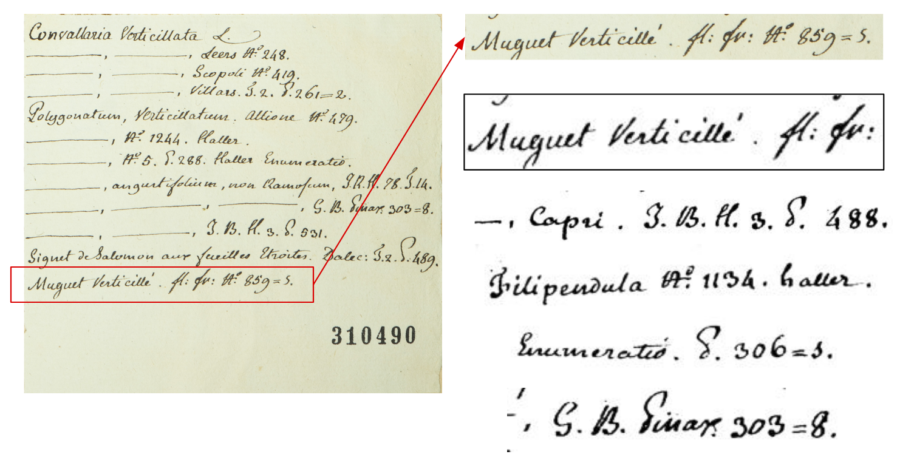
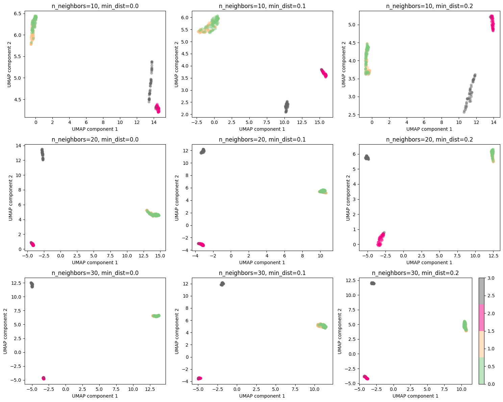
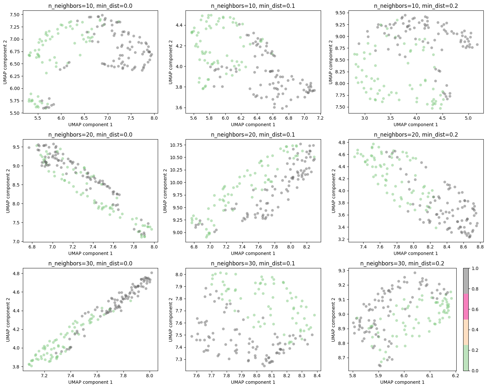
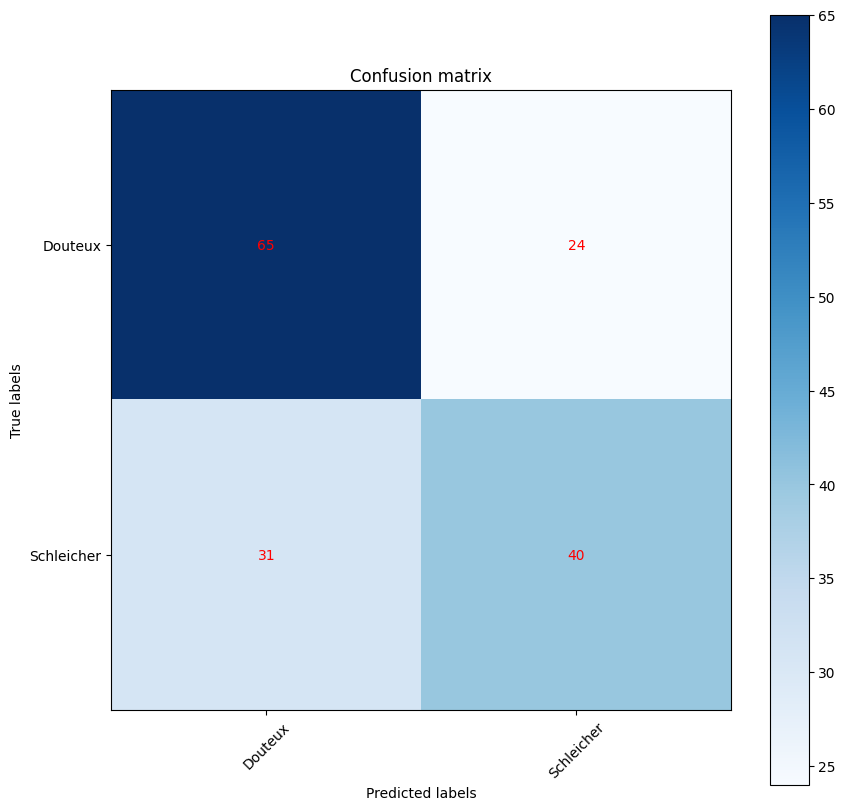
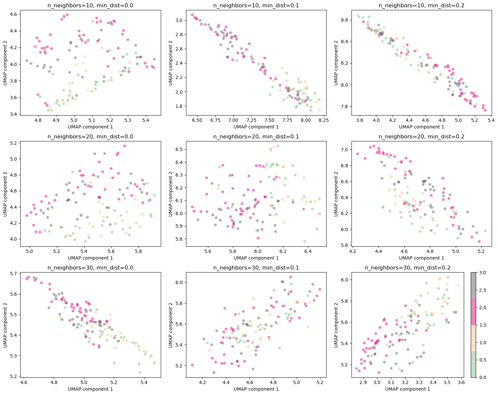
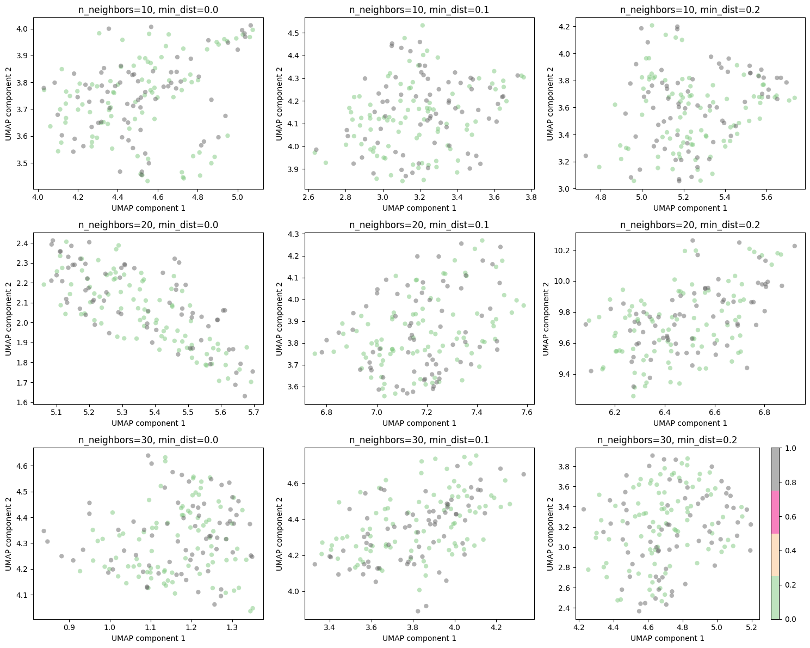

# MA_MLBD - Project Botanist

**Authors** : Eric Bousbaa, Dylan Canton, Thomas Robert

**School** : HES-SO

**Course** : MA_MLBD

**Date** : 24.01.2024

---

## 1. Context

The University of Neuchatel maintains an extensive collection of handwritten documents, primarily composed of field notes from botanists. The objective of this project is to develop a machine learning model capable of accurately identifying the authorship of these notes based on unique handwriting characteristics.

This project is undertaken as part of the 'Machine Learning and Big Data' course in the MSE formation at HES-SO.

## 2. Database description

We are working with two distinct datasets. The first, a public dataset, comprises pre-processed images of handwritten documents. These images, categorized into folders, include various types such as paragraphs, lines, sentences, and words. They have been pre-cropped and converted into a binary format (black and white), with each category accompanied by an associated metadata text file. However, it is important to note that the images are not all the same size.

The second dataset, known as the Neuchâtel dataset, consists of scanned document containing image, annotations, handwritten and typed text. These images are in their raw form: varying in size, uncropped, and in full color. The files are organized into folders by the botanist's name, including 'Chaillet', 'Douteux', and 'Other botanists'.

Below are two typical image examples from the Neuchâtel dataset:

|  |  |
|:----------------------------------------------------------:|:----------------------------------------------------------:|


## 3. Data pre-processing & feature extraction

The initial step involves normalizing the data from both the public and Neuchâtel datasets. Our aim is to ensure the writings are as similar as possible, thereby eliminating any bias and facilitating the extraction of pertinent features. We will commence with the Neuchâtel dataset, given its raw and unprocessed nature.

### OCR

Our initial task is to distinguish the handwritten text from the printed one.

While this could be done manually, we have opted for a more academic approach. We've chose to use [PaddleOCR](https://github.com/PaddlePaddle/PaddleOCR) to identify and crop the handwritten text within the images. Prior to saving the results, a pre-processing step is necessary. We've used [OpenCV](https://opencv.org/) to convert the images to black and white and resize them to a uniform height (in this case: 50px).

Below is an example of a processed image, following by some output image examples.



### OCR CNN

Unfortunately, PaddleOCR is unable to differentiate between handwritten and typed text. In order to automate this task, one possibility is to create another model to detect handwriting from non-handwriting on an image.
An initial implementation of a CNN model has been carried out, but as it did not perform satisfactorily (f1-score between 0.5 and 0.6), it was decided to carry out this part by hand in order to concentrate fully on the project's main objective. So, while we can use OCR to identify and extract text from images, it is then necessary to manually sort processed images containing handwritten or non-handwritten text.

### Data pre-processing & augmentation

We used a similar pre-processing approach for the public dataset. We resized the images to a uniform height (50px) and cropped them in the middle to a fixed width. This width was a parameter we could adjust to improve the model's performance, but value around 150px seems to work well. We didn't convert the images to black and white, as the dataset is already in this format.

We then augmented the dataset by altering the images in various ways via the keras `ImageDataGenerator` class. This included rotating, shifting, and zooming the images. We also flipped the images horizontally and vertically. This was done to increase the number of images available for training, thereby improving the model's performance.

## 4. Machine Learning Techniques

We decided to have two different approaches to this problem:

- A supervised CNN, trained to recognise the written author ;
- A unsupervices autoencoder, trained to reproduce the writting.

Post-training, the models serves to extract features from the dataset. These features, representative of the input data in a compressed form, are visualized using Uniform Manifold Approximation and Projection (UMAP). UMAP is a dimensionality reduction technique that helps in visualizing clusters or patterns in high-dimensional data. In our case, it's instrumental in demonstrating how distinct classes of handwriting are represented in the latent space. Hopefully, the latent space (or compressed space in the CNN).
We project the selected featured in a 2d plane.

### CNN

Our model started with a simple architecture with just some layers, just engough to do some first tests. We decided to improve it by using a dual-path structure with different filter sizes (3x3 and 5x5), enabling it to capture diverse features.

We try to avoid overfitting throug L2 regularization.
After our max pooling layers, we merge the two paths then add dense and dropout layer with a value of 0.2 to avoid overfitting.

```python
# Define modele
input_layer = keras.layers.Input(shape=(IMAGE_HEIGHT, IMAGE_WIDTH, 1))

# Define L1 and L2 regularization
l1_l2 = keras.regularizers.l1_l2(l1=0, l2=1e-4)

# path 1
conv1_1 = keras.layers.Conv2D(32, (3, 3), activation='relu', padding='same', kernel_regularizer=l1_l2)(input_layer)
pool1_1 = keras.layers.MaxPooling2D((2, 2))(conv1_1)
conv1_2 = keras.layers.Conv2D(64, (3, 3), activation='relu', padding='same', kernel_regularizer=l1_l2)(pool1_1)
pool1_2 = keras.layers.MaxPooling2D((2, 2))(conv1_2)

# path 2
conv2_1 = keras.layers.Conv2D(32, (5, 5), activation='relu', padding='same', kernel_regularizer=l1_l2)(input_layer)
pool2_1 = keras.layers.MaxPooling2D((2, 2))(conv2_1)
conv2_2 = keras.layers.Conv2D(64, (5, 5), activation='relu', padding='same', kernel_regularizer=l1_l2)(pool2_1)
pool2_2 = keras.layers.MaxPooling2D((2, 2))(conv2_2)

# merge paths
merged = keras.layers.concatenate([pool1_2, pool2_2])

flat = keras.layers.Flatten()(merged)
dense1 = keras.layers.Dense(128, activation='relu', kernel_regularizer=l1_l2, name=FLATTEN_LAYER_NAME)(flat)
dropout = keras.layers.Dropout(0.2)(dense1)  # Consider experimenting with the dropout rate
output_layer = keras.layers.Dense(N_CLASSES, activation='softmax')(dropout)

model = keras.models.Model(inputs=input_layer, outputs=output_layer)
model.compile(optimizer='adam', loss='categorical_crossentropy', metrics=['accuracy'])
```

After the merge of the paths, we use a flattened layer in the UMAP, with the named layer 'flattened'

The model employs categorical cross-entropy as its loss function, which is standard for multi-class classification problems. This loss function measures the difference between the actual and predicted probability distributions, effectively guiding the model towards accurate classifications. The model uses the Adam optimizer, a popular choice for deep learning models due to its efficiency and adaptive learning rate capabilities.

### Autoencoder

Our second model is the autoencoder. It uses three convolutional layers with decreasing filters (64, 32, 16).

```python
# Encoder
input_img = keras.layers.Input(shape=(IMAGE_HEIGHT, IMAGE_WIDTH, 1)) # adapt this if using `channels_first` image data format

x = keras.layers.Conv2D(64, (3, 3), activation='relu', padding='same')(input_img)
x = keras.layers.MaxPooling2D((2, 2), padding='same')(x)
x = keras.layers.Conv2D(32, (3, 3), activation='relu', padding='same')(x)
x = keras.layers.MaxPooling2D((2, 2), padding='same')(x)
x = keras.layers.Conv2D(16, (3, 3), activation='relu', padding='same')(x)
encoded = keras.layers.MaxPooling2D((2, 2), padding='same', name='encoded_layer')(x)

# Decoder
x = keras.layers.Conv2D(16, (3, 3), activation='relu', padding='same')(encoded)
x = keras.layers.UpSampling2D((2, 2))(x)
x = keras.layers.Conv2D(32, (3, 3), activation='relu', padding='same')(x)
x = keras.layers.UpSampling2D((2, 2))(x)
x = keras.layers.Conv2D(64, (3, 3), activation='relu', padding='same')(x)
x = keras.layers.UpSampling2D((2, 2))(x)
decoded = keras.layers.Conv2D(1, (3, 3), activation='sigmoid', padding='same')(x)

# Autoencoder model
autoencoder = keras.Model(input_img, decoded)
autoencoder.compile(optimizer='adam', loss='mean_squared_error')
```

We then use the latent space in the UMAP with the named layer "encoded_layer" :

```python
encoder_model = keras.Model(inputs=autoencoder.input, outputs=autoencoder.get_layer('encoded_layer').output)
```

This model uses the mean squared error (MSE) as loss function.

### K-fold

To ensure the reliability of our results, we use a k-fold cross validation for both models (autoencoder and CNN). This method is used to validate the model's performance on unseen data. It is particularly useful as our dataset is relatively small, as it allows us to use all the data for training and testing.

We used a k-fold cross validation to train our models, splitting the data in 5 folds. This approach is essential for validating the model's performance across different subsets of data.

```python
kf = KFold(n_splits=5, shuffle=True, random_state=42)
```

## 5. Experiments and results

### CNN experiments

**Train part**

For the training part, we used a UMAP to reduce the dimensionalities so that we could visualize the data on a two-dimensional plane. This display then allows us to visualize the distinct separation of classes by the model. We also implemented cross-validation (using a k-fold) to obtain a robust and stable evaluation and divided the dataset into 5 folds.

Here we can see the result of the UMAP display at the end of the fifth fold. We first tested two classes containing data from the public dataset only, and the model was able to distinguish and separate the two classes correctly.
We then added two more classes containing data from the Neuchâtel dataset, for a total of 4 classes tested. We can see that the model separates two classes very well, but has more difficulty for the remaining two classes (which tend to form a more dispersed and splintered group of points). We believe that the 2 well-separated classes are those of the public dataset, while the other 2 classes belong to the neuchatel dataset.



**Test part**

For the test part, we used a UMAP to evaluate the model's ability to predict on new data. We tested this by randomly comparing two of the 4 botanists (those with the most samples) and an 'Others' class containing samples from the remaining botanists (those without enough samples to form a class in their own right).
We can see that, in contrast to training, performance is poorer when the model only uses data from the Neuchatel dataset. The model seems to succeed slightly in separating the 2 classes, but in a very dispersed manner, without succeeding in establishing clear clusters.



It is also possible to view the predicted classes with a confusion matrix, and here we see results correlated with the UMAP. The predictions are more or less 50/50, with an average f1-score of 0.5-0.6.




### Autoencoder experiments

For the autoencoder, we also use a UMAP to reduce the dimensions in order to visualize the data on a two-dimensional plane. The use of data here is similar to that of the CNN, using 2 classes from the public database and 2 classes from the Neuchâtel database.

It can be seen that performance is lower than with CNN. Clusters have difficulty forming and classes are scattered on the 2D plane. While the CNN model showed good performance in separating public dataset classes, the autoencoder seems to have trouble separating both public dataset classes and Neuchâtel dataset classes.

**Train part**



**Test part**

Since training does not produce satisfactory results, the test shows that performance does not improve. 




## 6. Analysis and conclusions

The main objective of this project was to create a classification model to recognise and group botanists' handwriting types from an image.
First of all, we were able to automate some of the data extraction using OCR. Although we had tried to create another CNN model to recognise handwritten text from non-handwritten text, we decided to do this step manually in order to concentrate on the main model.

We considered two approaches to creating the main model, using a CNN or an auto-encoder. In terms of performance, the CNN is superior to the auto-encoder, showing very good results with data from the public dataset, but having difficulty differentiating data from the Neuchâtel dataset. The autoencoder did not perform satisfactorily overall. The CNN's performance is less satisfactory when we test the model with new data. The model has difficulty recognizing classes, and although the UMAP display shows separation, this is still very scattered and does not produce clusters as accurately as we would like.

This can be explained by the fact that the samples in the Neuchâtel dataset are very similar, and it is very difficult, even with the naked eye, to differentiate one entry from another. To improve the performance of this model, the following points should be considered:

- Increase the number of samples in the Neuchâtel dataset, as some botanists only have 2 or 3 samples. It should be possible to collect more data.
- Find a suitable model and use the fine-tuning of the training model to adjust certain parameters so that it is better suited to the type of data in the Neuchâtel dataset.

The solution developed as part of this project has achieved very good results in classifying publication types in the public dataset. However, it needs to be improved if it is to be fully effective on the writings of Neuchâtel botanists.
