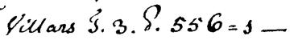
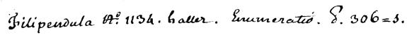
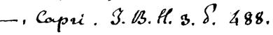
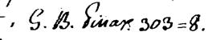
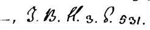
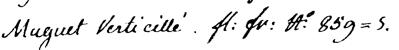

# MA_MLBD - Project Botanist

**Authors** : Eric Bousbaa, Dylan Canton, Thomas Robert

**School** : HES-SO

**Course** : MA_MLBD

**Date** : 24.01.2024

---

[TOC]

---

TODO:

- Augmenter le dataset neuchatel : Dylan
- Tester avec dataset neuchatel : Eric + Thomas
- code cleanup + marche à suivre : Eric
- Présentation : Tous (<https://docs.google.com/presentation/d/1UJyt7ywg6fFq_mlWROCbzvzzPN0oVw38ch_AZ46q7xQ/edit?usp=sharing>)

## 1. Context

The University of Neuchatel maintains an extensive collection of handwritten documents, primarily composed of field notes from botanists. The objective of this project is to develop a machine learning model capable of accurately identifying the authorship of these notes based on unique handwriting characteristics.

This project is undertaken as part of the 'Machine Learning and Big Data' course in the MSE formation at HES-SO.

## 2. Database description

We are working with two distinct datasets. The first, a public dataset, comprises pre-processed images of handwritten documents. These images, categorized into folders, include various types such as paragraphs, lines, sentences, and words. They have been pre-cropped and converted into a binary format (black and white), with each category accompanied by an associated metadata text file. However, it is important to note that the images are not all the same size.

The second dataset, known as the Neuchâtel dataset, consists of scanned document containing image, annotations, handwritten and typed text. These images are in their raw form: varying in size, uncropped, and in full color. The files are organized into folders by the botanist's name, including 'Chaillet', 'Douteux', and 'Other botanists'.

Below are two typical image examples from the Neuchâtel dataset:

## 3. Data pre-processing & feature extraction

The initial step involves normalizing the data from both the public and Neuchâtel datasets. Our aim is to ensure the writings are as similar as possible, thereby eliminating any bias and facilitating the extraction of pertinent features. We will commence with the Neuchâtel dataset, given its raw and unprocessed nature.

### OCR

Our initial task is to distinguish the handwritten text from the printed one.

While this could be done manually, we have opted for a more academic approach. We've chose to use [PaddleOCR](https://github.com/PaddlePaddle/PaddleOCR) to identify and crop the handwritten text within the images. Prior to saving the results, a pre-processing step is necessary. We've used [OpenCV](https://opencv.org/) to convert the images to black and white and resize them to a uniform height (in this case: 50px).

Below are three cropped results from each of the previously displayed images from the Neuchâtel dataset:

  

  

### OCR CNN

TODO: Dylan

Unfortunately, PaddleOCR is not able to differentiate handwritten text from typed text. We tried to create another model to detect handwritten text vs printed one, but we decided to focus on the main goal of the project and do this part by hand.

### Data pre-processing & augmentation

We used a similar pre-processing approach for the public dataset. We resized the images to a uniform height (50px) and cropped them in the middle to a fixed width. This width was a parameter we could adjust to improve the model's performance, but value around 150px seems to work well. We didn't convert the images to black and white, as the dataset is already in this format.

We then augmented the dataset by altering the images in various ways via the keras `ImageDataGenerator` class. This included rotating, shifting, and zooming the images. We also flipped the images horizontally and vertically. This was done to increase the number of images available for training, thereby improving the model's performance.

## 4. Machine Learning Techniques

TODO: Eric

### CNN

### Autoencoder

*A brief description mentioning the ML techniques used and explaining why you chose them. Present the parameters of your model and explain how you selected them (e.g., in the case of an ANN: topology, activation functions, number of layers, number of hidden neurones per layer, etc). Present the parameters of the learning algorithm and explain how you selected them. (1 page)*

## 5. Experiments and results

TODO: Dylan

*Experiments and results: describe the experiments and the results. Explain the reasoning behind those experiments, e.g., what are the hypothesis ? Use performance measures to evaluate them and explain the results*

## 6. Analyse et conclusions

TODO: Dylan
